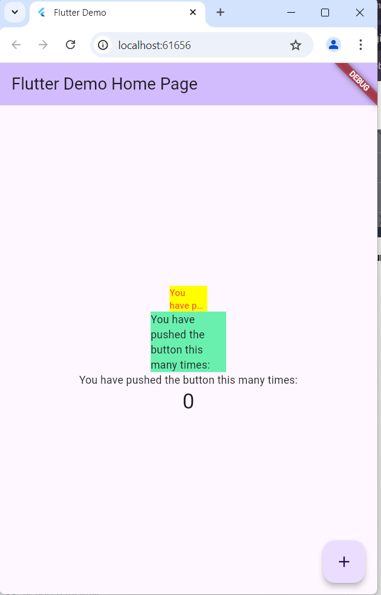

LAPORAN PRAKTIKUM
#           JOBSHEET-6 : Layout dan Navigasi
                        TUGAS PEMROGRAMAN MOBILE
            Dibimbing oleh: Bapak Ade Ismail, S.Kom., M.TI.

                        Disusun oleh: 

                    Nama: Yolanda Ekaputri Setyawan
                    NIM : 22241760028
                    KELAS : SIB - 3d
                    JURUSAN TEKNOLOGI INFORMASI
                    PRODI D-IV SISTEM INFORMASI BISNIS
                    POLITEKNIK NEGERI MALANG
                                2024

# Praktikum
## Praktikum Menerapkan Plugin di Project Flutter
1. Langkah 1: Buat Project Baru                             
Buatlah sebuah project flutter baru dengan nama flutter_plugin_pubdev. Lalu jadikan repository di GitHub Anda dengan nama flutter_plugin_pubdev.
2. Langkah 2: Menambahkan Plugin            
Tambahkan plugin auto_size_text menggunakan perintah berikut di terminalJika berhasil, maka akan tampil nama plugin beserta versinya di file pubspec.yaml pada bagian dependencies.
3. Langkah 3: Buat file red_text_widget.dart    
Buat file baru bernama red_text_widget.dart di dalam folder lib 
4. Langkah 4: Tambah Widget AutoSizeText        
Masih di file red_text_widget.dart, untuk menggunakan plugin auto_size_text, ubahlah kode return Container() menjadi seperti berikut.       
Setelah Anda menambahkan kode di atas, Anda akan mendapatkan info error. Mengapa demikian? Jelaskan dalam laporan praktikum Anda!
    -  Undefined name 'text'.
Try correcting the name to one that is defined, or defining the name.dartundefined_identifier
5. Langkah 5: Buat Variabel text dan parameter di constructor       
Tambahkan variabel text dan parameter di constructor seperti berikut.
6. Langkah 6: Tambahkan widget di main.dart     
Buka file main.dart lalu tambahkan di dalam children: pada class _MyHomePageState
Output: 

